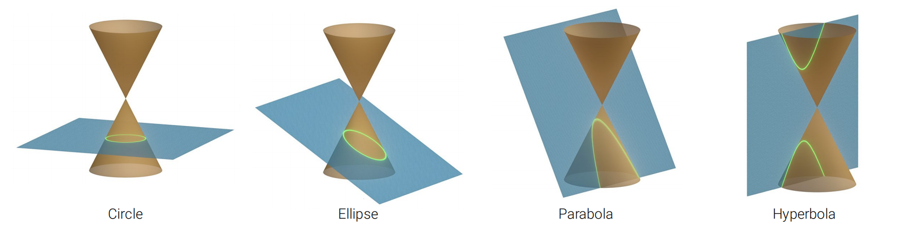
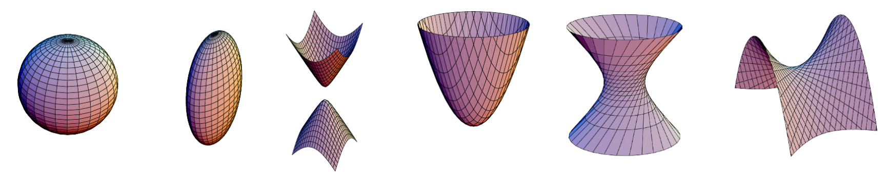
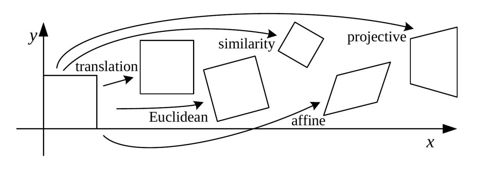
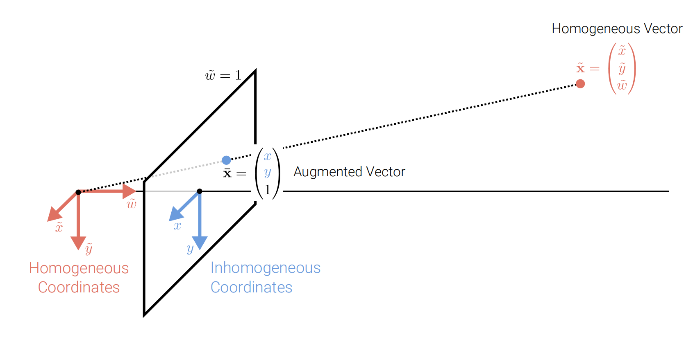

# Image_Formation

## Primitives and Transformations

Geometric primitives(几何图元) are the basic building blocks used to describe 3D shapes, such as points, lines, planes, and polygons.

## 2D Primitives

### 2D Points

**2D points** can be written in **inhomogeneous coordinates**(非齐次坐标) as

$$\mathbf{x} =(x,y)^T\in \mathbb{R}^2$$

or in **homogeneous coordinates**(齐次坐标) as

$$\widetilde{\mathbf{x}} =\left(\widetilde{x},\widetilde{y},\widetilde{w}\right)^T\in \mathbb{P}^2$$

where $ \mathbb{P}^2 ( = \mathbb{R}^3)$ is the **projective plane**(射影空间) and $\widetilde{\mathbf{x}}$ is a **projective point**(投影点).
> The tilde sign (~) is a convention for homogeneous coordinates.
> Homogeneous vectors are defined only up to scale.

**Inhomogeneous vector** $\mathbf{x}$ is converted to a **homogeneous vector** $\widetilde{\mathbf{x}}$ as follows:

$$\widetilde{\mathbf{x} }=\begin{pmatrix}\widetilde{x}\\\widetilde{y}\\\widetilde{w}\end{pmatrix}=\begin{pmatrix}x\\y\\1\end{pmatrix}=\begin{pmatrix}\mathbf{x}\\1\end{pmatrix}= \overline{\mathbf{x} }$$

where $\overline{x}$ is the **augmented vector**(增广向量) of $\mathbf{x}$.
> We say augmented vector $\overline{\mathbf{x} }$ for all homogeneous vectors which last coordinate is equal to 1.
> Special vector: Homogeneous points whose last element is $\widetilde{w}=0$ are called **ideal points** or **points at infinity**. These points can’t be represented with inhomogeneous coordinates!

### 2D Lines

**2D lines** can also be expressed using **homogeneous coordinates**(齐次坐标) $\mathbf{\widetilde{l}}=(a,b,c)^T$ : $$\{\mathbf{\overline{x}}|{\mathbf{\overline{x}}}^T\mathbf{\widetilde{l}}=0\} \Leftrightarrow \{x,y | ax+by+c=0\}$$

左到右是因为 $\mathbf{\overline{x}}^T\mathbf{\widetilde{l}}=0 \Rightarrow (x,y,1)\begin{pmatrix}a\\b\\c\end{pmatrix}=0 \Rightarrow ax+by+c=0$

标准化 $\mathbf{\widetilde{l}}$：$\mathbf{\widetilde{l}}=(n_x,n_y,d)^T$，
其中 $n_x^2+n_y^2=1$， $(n_x,n_y)$ 是 $\mathbf{\widetilde{l}}$ 的**法向量** ，$d$ 是 $\mathbf{\widetilde{l}}$ 到原点的距离.

> An exception is the **line at infinity** $\mathbf{\widetilde{l}}_{\infty}=(0,0,1)^T$, which passes through all ideal points.

### 2D Line Arithmetic

In homogeneous coordinates, **the intersection of two lines** is given by:
$$\mathbf{\overline{x}}=\mathbf{\widetilde{l}}_1\times \mathbf{\widetilde{l}}_2$$

where $\times$ is the **cross product** of two vectors.

Similarly, **the intersection of two points** is given by:
$$\mathbf{\widetilde{l}}=\mathbf{\overline{x}}_1\times \mathbf{\overline{x}}_2$$

### 2D Conics(二次曲线)

More complex algebraic objects can be represented using **polynomial homogeneous equations**. For example, **conic sections** (arising as the intersection of a plane and a 3D cone) can be written using quadric equations:

$$\mathbf{\overline{x}}^T\mathbf{Q}\mathbf{\overline{x}}=0$$

## 3D Primitives

### 3D Points

**3D points** can be written in **inhomogeneous coordinates** as
$$\mathbf{x}=(x,y,z)^T\in \mathbb{R}^3$$
or in **homogeneous coordinates** as
$$\widetilde{\mathbf{x}}=(\widetilde{x},\widetilde{y},\widetilde{z},\widetilde{w})^T\in \mathbb{P}^3$$

where $\mathbb{P}^3(=\mathbb{R}^4)$ is the **projective space**.

### 3D Planes

**3D planes** can be expressed using homogeneous coordinates $\mathbf{\widetilde{m}}=(a,b,c,d)^T$:
$$\{\mathbf{\overline{x}}|{\mathbf{\overline{x}}}^T\mathbf{\widetilde{m}}=0\} \Leftrightarrow \{x,y,z | ax+by+cz+d=0\}$$

标准化 $\mathbf{\widetilde{m}}$：$\mathbf{\widetilde{m}}=(n_x,n_y,n_z,d)^T$
其中 $n_x^2+n_y^2+n_z^2=1$, $(n_x,n_y,n_z)$ 是 $\mathbf{\widetilde{m}}$ 的**法向量**，$d$ 是 $\mathbf{\widetilde{m}}$ 到原点的距离。

> An exception is the **plane at infinity** $\mathbf{\widetilde{m}}_{\infty}=(0,0,0,1)^T$, which passes through all ideal points.

### 3D Lines

**3D lines** are less elegant than either 2D lines or 3D planes. One possible representation
is to express points on a line as a **linear combination** of two points $\mathbf{p}$ and $\mathbf{q}$ on the line:

$$\{\mathbf{x}|\mathbf{x}=(1-\lambda)\mathbf{p}+\lambda\mathbf{q},\lambda\in \mathbb{R}\}$$

However, this representation uses 6 parameters($\mathbf{p}$和$\mathbf{q}$分别三个参数) for 4 degrees of freedom(一个点(3个不自由度)+方向(1个不自由度)).
> 所以可以用**two-plane parameterization**（两平面参数化）来表示3D line.

### 3D Quadrics(二次曲面)

The 3D analog of 2D conics is a **quadric surface**:

$$\mathbf{\overline{x}}^T\mathbf{Q}\mathbf{\overline{x}}=0$$

**Superquadrics**: generalization of quadrics

## 2D Transformations

### Translation

**Translation**: (2D Translation of the Input, 2 DoF(两个自由度: $t_x$和$t_y$))

$$\mathbf{x}'=\mathbf{x}+\mathbf{t} \Leftrightarrow \begin{pmatrix}x'\\y'\\1\end{pmatrix}=\begin{bmatrix}1&0&t_x\\0&1&t_y\\0&0&1\end{bmatrix}\begin{pmatrix}x\\y\\1\end{pmatrix} \Leftrightarrow \mathbf{\overline{x}}'=\begin{bmatrix}\mathbf{I}&\mathbf{t}\\\mathbf{0}^T&1\end{bmatrix}\mathbf{\overline{x}}$$

> - Using homogeneous representations allows to chain/invert transformations.
> - Augmented vectors $\mathbf{\overline{x}}$ can always be replaced by general homogeneous ones $\widetilde{\mathbf{x}}$.

### Euclidean

**Euclidean**: (2D Translation + 2D Rotation, 3 DoF)

$$\mathbf{x}'=\mathbf{R}\mathbf{x}+\mathbf{t} \Leftrightarrow \begin{pmatrix}x'\\y'\\1\end{pmatrix}=\begin{bmatrix}\cos\theta&-\sin\theta&t_x\\\sin\theta&\cos\theta&t_y\\0&0&1\end{bmatrix}\begin{pmatrix}x\\y\\1\end{pmatrix} \Leftrightarrow \mathbf{\overline{x}}'=\begin{bmatrix}\mathbf{R}&\mathbf{t}\\\mathbf{0}^T&1\end{bmatrix}\mathbf{\overline{x}}$$

> - $\mathbf{R} \in SO(2)$: **special orthogonal group** of 2D rotations,which is an **orthogonal rotation matrix** with $\mathbf{R}^T\mathbf{R}=\mathbf{I}$ and $\det(\mathbf{R})=1$.
> - Euclidean transformations preserve Euclidean distances

### Similarity

**Similarity**: (2D Translation + Scaled 2D Rotation, 4 DoF)

$$\mathbf{x}'=s\mathbf{R}\mathbf{x}+\mathbf{t} \Leftrightarrow \begin{pmatrix}x'\\y'\\1\end{pmatrix}=\begin{bmatrix}s\cos\theta&-s\sin\theta&t_x\\s\sin\theta&s\cos\theta&t_y\\0&0&1\end{bmatrix}\begin{pmatrix}x\\y\\1\end{pmatrix} \Leftrightarrow \mathbf{\overline{x}}'=\begin{bmatrix}s\mathbf{R}&\mathbf{t}\\\mathbf{0}^T&1\end{bmatrix}\mathbf{\overline{x}}$$

> - $s$ is the **scale factor**.
> - The similarity transform preserves angles between lines

### Affine

**Affine**: (2D Translation + 2D Rotation + 2D Shear, 6 DoF)

$$\mathbf{x}'=\mathbf{A}\mathbf{x}+\mathbf{t} \Leftrightarrow \begin{pmatrix}x'\\y'\\1\end{pmatrix}=\begin{bmatrix}a_{11}&a_{12}&t_x\\a_{21}&a_{22}&t_y\\0&0&1\end{bmatrix}\begin{pmatrix}x\\y\\1\end{pmatrix} \Leftrightarrow \mathbf{\overline{x}}'=\begin{bmatrix}\mathbf{A}&\mathbf{t}\\\mathbf{0}^T&1\end{bmatrix}\mathbf{\overline{x}}$$

> - $\mathbf{A}$ is an **arbitrary 2D matrix**.
> - Parallel lines remain parallel under affine transformations

### Projective

**Projective**: (2D Translation + 2D Rotation + 2D Shear + 2D Homography, 8 DoF)（对同构矩阵整体乘以一个常数并不改变射影变换,所以可以让其中一个元素取任意定值(例如取1),等价去掉一个自由度）

$$\mathbf{\widetilde{x}}'=\mathbf{\widetilde{H}}\mathbf{\widetilde{x}} \Leftrightarrow \begin{pmatrix}\widetilde{x}'\\\widetilde{y}'\\\widetilde{w}'\end{pmatrix}=\begin{bmatrix}h_{11}&h_{12}&h_{13}\\h_{21}&h_{22}&h_{23}\\h_{31}&h_{32}&h_{33}\end{bmatrix}\begin{pmatrix}\widetilde{x}\\\widetilde{y}\\\widetilde{w}\end{pmatrix} \Leftrightarrow \mathbf{\overline{x}}'=\frac{1}{\widetilde{w}'}\widetilde{x}'$$

> - $\mathbf{\widetilde{H}}$ is an **arbitrary homogeneous 3x3 matrix**.
> - Projective transformations preserve straight lines

### 2D Transformations on Co-vectors

Consider a **covector** $\mathbf{\widetilde{l}}=(a,b,c)^T$ representing a 2D line. How does it transform under a 2D transformation $\mathbf{H}$?

**Answer**: $\mathbf{\widetilde{l}'}=\mathbf{H}^{-T}\mathbf{\widetilde{l}}$

**Solution**: Consider a point $\mathbf{\overline{x}}$ on the line $\mathbf{\widetilde{l}}$:

Considering any perspective 2D transformation:
$$ \mathbf{\widetilde{x}}'=\mathbf{H}\mathbf{\widetilde{x}}$$

the transformed 2D line equation is given by:
$$\mathbf{\widetilde{l}'}^T\mathbf{\widetilde{x}}'=\mathbf{\widetilde{l}}^T\mathbf{\widetilde{x}}=0$$

So:
$$\mathbf{\widetilde{l}'}^T\mathbf{H}\mathbf{\widetilde{x}}=\mathbf{\widetilde{l}}^T\mathbf{\widetilde{x}}=0$$

which implies:
$$\mathbf{\widetilde{l}'}=\mathbf{H}^{-T}\mathbf{\widetilde{l}}$$
> Thus, the action of a projective transformation on a co-vector such as a 2D line or 3D normal can be represented by the transposed inverse of the matrix.

### Overview of 2D Transformations

| Transformation | DoF | Preserves | Matrix |
| :---: | :---: | :---: | :---: |
| Translation | 2 | Orientation | $\begin{bmatrix}\mathbf{I}&\mathbf{t}\end{bmatrix}_{2\times 3}$ |
| Rigid(Euclidean) | 3 | Length | $\begin{bmatrix}\mathbf{R}&\mathbf{t}\end{bmatrix}_{2\times 3}$ |
| Similarity | 4 | Angles | $\begin{bmatrix}s\mathbf{R}&\mathbf{t}\end{bmatrix}_{2\times 3}$ |
| Affine | 6 | Parallelism | $\begin{bmatrix}\mathbf{A}&\mathbf{t}\end{bmatrix}_{2\times 3}$ |
| Projective | 8 | Straight lines | $\begin{bmatrix}\mathbf{\widetilde{H}}\end{bmatrix}_{3\times 3}$ |

> - Interpret as restricted $3 × 3$ matrices operating on 2D homogeneous coordinates
> - Transformations preserve properties below

### Overview of 3D Transformations

| Transformation | DoF | Preserves | Matrix |
| :---: | :---: | :---: | :---: |
| Translation | 3 | Orientation | $\begin{bmatrix}\mathbf{I}&\mathbf{t}\end{bmatrix}_{3\times 4}$ |
| Rigid(Euclidean) | 6 | Length | $\begin{bmatrix}\mathbf{R}&\mathbf{t}\end{bmatrix}_{3\times 4}$ |
| Similarity | 7 | Angles | $\begin{bmatrix}s\mathbf{R}&\mathbf{t}\end{bmatrix}_{3\times 4}$ |
| Affine | 12 | Parallelism | $\begin{bmatrix}\mathbf{A}&\mathbf{t}\end{bmatrix}_{3\times 4}$ |
| Projective | 15 | Straight lines | $\begin{bmatrix}\mathbf{\widetilde{H}}\end{bmatrix}_{4\times 4}$ |

> - 3D transformations are defined analogously(类似的) to 2D transformations
> - $3 × 4$ matrices are extended with a fourth $\begin{bmatrix}\mathbf{0}^T&1\end{bmatrix}$ row for homogeneous transforms.
> - Transformations preserve properties below (similarity: parallelism, straight lines)

### Direct Linear Transform for Homography Estimation

> 用直接线性变换(DLT)估计单应性矩阵(Homography Matrix)

How can we estimate a homography from a set of 2D correspondences?

> - 2D correspondences: $\mathbf{x}_i \leftrightarrow \mathbf{x}'_i$
>   - $\mathbf{x}_i$ is a point in the first image
>   - $\mathbf{x}'_i$ is the corresponding point in the second image
> - Homography: $\mathbf{\widetilde{x}}'_i=\mathbf{\widetilde{H}}\mathbf{\widetilde{x}}_i$

Let $\mathcal{X}=\{\mathbf{\widetilde{x},\widetilde{x}'}\}$ denote a set of N 2D-to-2D correspondences related by $\mathbf{\widetilde{x}}'_i=\mathbf{\widetilde{H}}\mathbf{\widetilde{x}}_i$.As the correspondence vectors are homogeneous, they have **the same direction but differ in magnitude**.

> Why to say "the same direction but differ in magnitude"?
> See the following picture:
> 

Thus, the equation above can be expressed as $\mathbf{\widetilde{x}}'_i\times\mathbf{\widetilde{H}}\mathbf{\widetilde{x}}_i=0$. Using the $\mathbf{\widetilde{h}}^T_k$ to denote the k-th row of $\mathbf{\widetilde{H}}$, we can write:

> Note:
>
> 1. $\mathbf{a}\times\mathbf{b}=\begin{bmatrix}0&-a_3&a_2\\a_3&0&a_1\\-a_2&a_1&0\end{bmatrix} \begin{pmatrix}b_1\\b_2\\b_3\end{pmatrix}=\begin{pmatrix}a_2b_3-a_3b_2\\a_3b_1-a_1b_3\\a_1b_2-a_2b_1\end{pmatrix}$

展开叉乘运算:
$\begin{aligned}
&\mathbf{\widetilde{x}}'_i \times (\mathbf{\widetilde{H}}\mathbf{\widetilde{x}}_i) = 0\\
\Leftrightarrow & \begin{bmatrix}
0 & -\widetilde{w}'_i & \widetilde{y}'_i \\
\widetilde{w}'_i & 0 & -\widetilde{x}'_i\\
-\widetilde{y}'_i & \widetilde{x}'_i & 0
\end{bmatrix}
\begin{bmatrix}
\mathbf{\widetilde{h}}^T_1\\
\mathbf{\widetilde{h}}^T_2\\
\mathbf{\widetilde{h}}^T_3
\end{bmatrix}\mathbf{\widetilde{x}}_i = 0\\
\Leftrightarrow & \begin{bmatrix}
0^T_{1\times 3} & -\widetilde{w}'_i\mathbf{\widetilde{x}}_i^T & \widetilde{y}'_i\mathbf{\widetilde{x}}_i^T\\
\widetilde{w}'_i\mathbf{\widetilde{x}}_i^T & 0^T_{1\times 3} & -\widetilde{x}'_i\mathbf{\widetilde{x}}_i^T\\
-\widetilde{y}'_i\mathbf{\widetilde{x}}_i^T & \widetilde{x}'_i\mathbf{\widetilde{x}}_i^T & 0^T_{1\times 3}
\end{bmatrix}_{3\times 9}
\begin{bmatrix}
\mathbf{\widetilde{h}}_1\\
\mathbf{\widetilde{h}}_2\\
\mathbf{\widetilde{h}}_3
\end{bmatrix}_{9\times 1} = 0
\end{aligned}
$

> - 第二步到第三步是因为 $\mathbf{h}_i^T \mathbf{\widetilde{x}}_i$是一个数，所以$\mathbf{h}_i^T \mathbf{\widetilde{x} }_i = \mathbf{\widetilde{x} }_i^T \mathbf{h}_i$。
> - 这样就可以用左边的数据来估计 $\mathbf{H}$ 了。
> - 最后一行的三个方程是冗余的，因为$-\widetilde{w}'_iR_3 = \widetilde{x}'_i R_1 + \widetilde{y}'_i R_2$。

Each point correspondence yields two equations. Stacking all equations into a 2N × 9 dimensional matrix A leads to the following constrained least squares problem