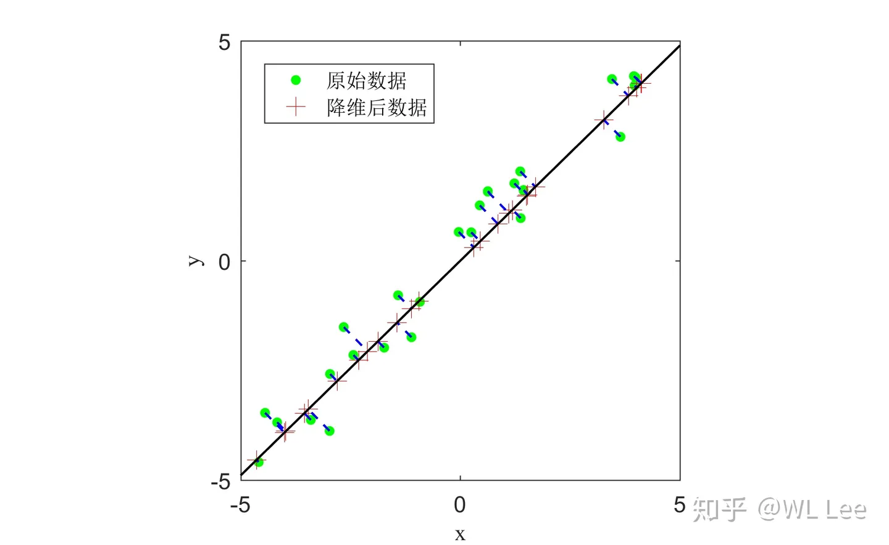
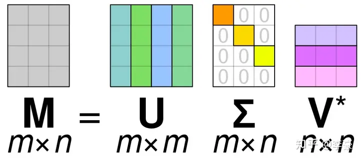

# SVD

## SVD要干什么？

奇异值分解就是在低维空间中寻找最接近原矩阵 $A$ 的低维矩阵 $M$ ,说白了就是数据降维。
就像这样：

## SVD简介

意思是任何一个矩阵$A$都可以被分解成$A=U\Sigma V^T$，其中$U$和$V$都是正交矩阵，$\Sigma$矩阵的形式有三种形式：

$$
\Sigma = \begin{bmatrix}
\sigma_1&0&\cdots&0\\
0&\sigma_2&\cdots&0\\
\vdots&\vdots&\ddots&\vdots\\
0&0&\cdots&\sigma_n
\end{bmatrix}
,\quad
\Sigma = \begin{bmatrix}
\sigma_1&0&\cdots&0\\
0&\sigma_2&\cdots&0\\
\vdots&\vdots&\ddots&\vdots\\
0&0&\cdots&\sigma_r\\
0&0&\cdots&0\\
\vdots&\vdots&\ddots&\vdots\\
0&0&\cdots&0\end{bmatrix}
,\quad
\Sigma = \begin{bmatrix}
\sigma_1&0&\cdots&0&0&\cdots&0\\
0&\sigma_2&\cdots&0&0&\cdots&0\\
\vdots&\vdots&\ddots&\vdots&\vdots&\ddots&\vdots\\
0&0&\cdots&\sigma_r&0&\cdots&0
\end{bmatrix}
$$

## 伪逆

构造$\Sigma^+$，形式分别对应上述三种形式，如下：

$$
\Sigma^+ = \begin{bmatrix}
\sigma_1^{-1}&0&\cdots&0\\
0&\sigma_2^{-1}&\cdots&0\\
\vdots&\vdots&\ddots&\vdots\\
0&0&\cdots&\sigma_r^{-1}
\end{bmatrix}
,\quad
\Sigma^+ = \begin{bmatrix}
\sigma_1^{-1}&0&\cdots&0\\
0&\sigma_2^{-1}&\cdots&0\\
\vdots&\vdots&\ddots&\vdots\\
0&0&\cdots&\sigma_r^{-1}\\
0&0&\cdots&0\\
\vdots&\vdots&\ddots&\vdots\\
0&0&\cdots&0
\end{bmatrix}
,\quad
\Sigma^+ = \begin{bmatrix}
\sigma_1^{-1}&0&\cdots&0&0&\cdots&0\\
0&\sigma_2^{-1}&\cdots&0&0&\cdots&0\\
\vdots&\vdots&\ddots&\vdots&\vdots&\ddots&\vdots\\
0&0&\cdots&\sigma_r^{-1}&0&\cdots&0
\end{bmatrix}
$$

此时有$\Sigma\Sigma^+=I$

用SVD求解线性方程组$Ax=b$，有：

$$
\begin{align*}
Ax&=b\\
U\Sigma V^Tx&=b\\
\Sigma V^Tx&=U^Tb\\
V^Tx&=\Sigma^+U^Tb\\
x&=V\Sigma^+U^Tb
\end{align*}
$$

所以$A^+=V\Sigma^+U^T$，称为$A$的**伪逆**。

## 关于解的讨论

这里不一定存在解 $x$ 使得$Ax=b$，但是一定存在最小二乘解 $x'$ 使得$\|Ax'-b\|$最小，且这个最小二乘解就是$x'=V\Sigma^+U^Tb$。

对于$A_{m\times n}$，有：

1. $m = n$ （方程数等于未知数）
   - 满秩：$A^+=A^{-1} \Rightarrow x=A^{-1}b$, $x$ 存在且唯一，使得$Ax=b$
   - 不满秩：$x'$ 存在但不唯一（但它是模长最小的最小二乘解），使得$\|Ax'-b\|$最小
2. $m > n$ （方程数多于未知数）
   - 满秩：$x'$ 是唯一的最小二乘解，使得$\|Ax'-b\|$最小
   - 不满秩：$x'$ 存在但不唯一（但它是模长最小的最小二乘解），使得$\|Ax'-b\|$最小
3. $m < n$ （方程数少于未知数）
   - 满秩：不唯一的解 (是解，不是最小二乘解)，但它是模长最小的解
   - 不满秩：$x'$ 存在但不唯一（但它是模长最小的最小二乘解），使得$\|Ax'-b\|$最小

## np.linalg.svd(a,full_matrices=1,compute_uv=1)用法描述

- a: 要进行奇异值分解的矩阵
- full_matrices: 是否返回完整的U和V矩阵，如果设为False，则返回奇异值分解后的Sigma矩阵是m×n的奇异值矩阵（对角线上是奇异值，其它为0），如果为True，则返回的U和V矩阵是方阵。
- compute_uv: 是否计算 $U$、$V$ 矩阵，如果设为False，则只返回奇异值分解后的 $\Sigma$ 矩阵，否则返回完整的奇异值分解结果。

## $Ax=0$ 的最小二乘解是 $V$ 的最后一列

在实际中，所关心的并非是齐次最小二乘问题的零解，而是它的非零解。
记 $y=V^Tx$
$$
\begin{align*}
\|Ax\|^2 &= \|U\Sigma V^Tx\|^2 \\
&= (U \Sigma V^Tx)^T(U\Sigma V^Tx) \\
&= x^TV\Sigma^TU^TU\Sigma V^Tx \\
&= x^TV\Sigma^T\Sigma V^Tx \\
&= y^T\Sigma^T\Sigma y \\
&= \sum_{i=1}^r\sigma_i^2y_i^2
\end{align*}
$$
因为在$\Sigma$上， $\sigma_1 \geq \cdots \geq \sigma_r$，约束条件为$\|y\|=1$(加上$\|y\|=1$的约束是为了获得非零解。)
